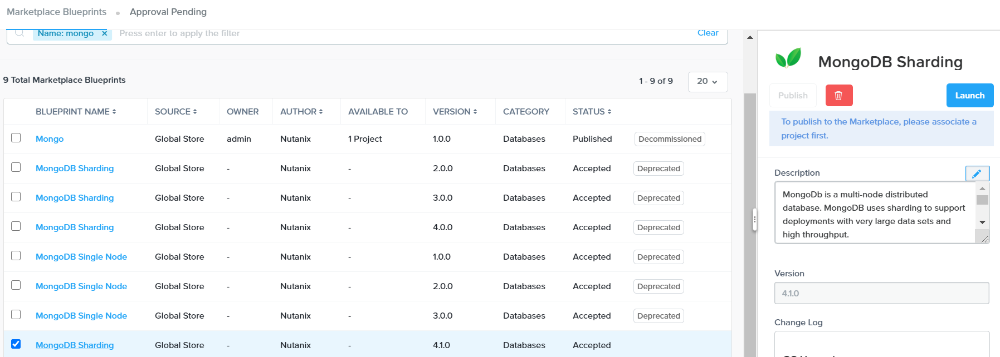
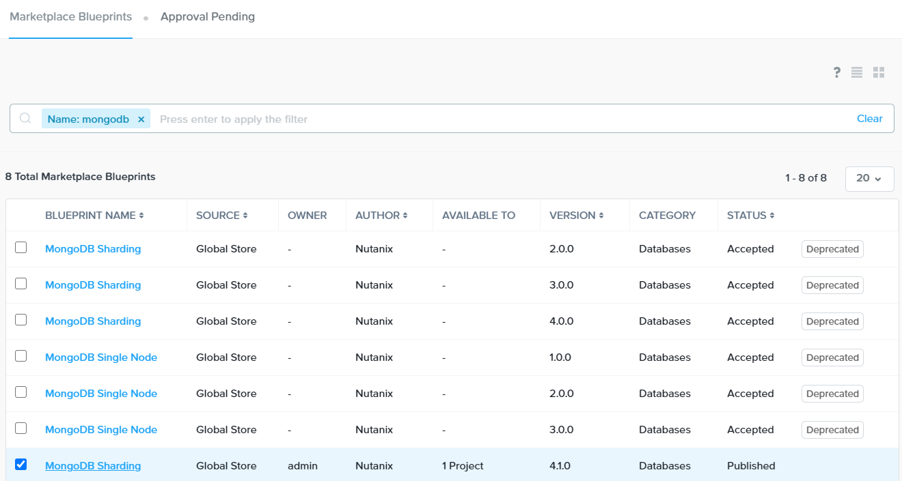
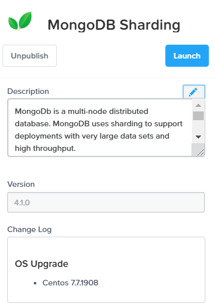
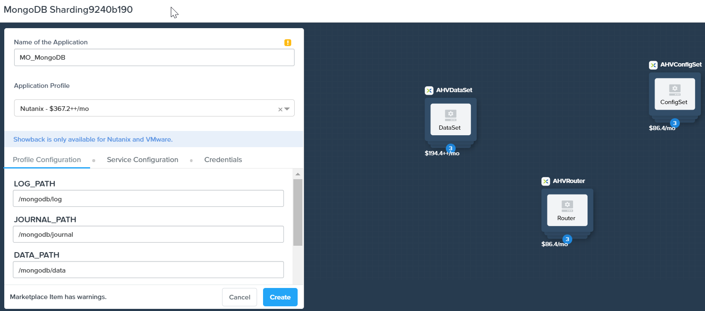
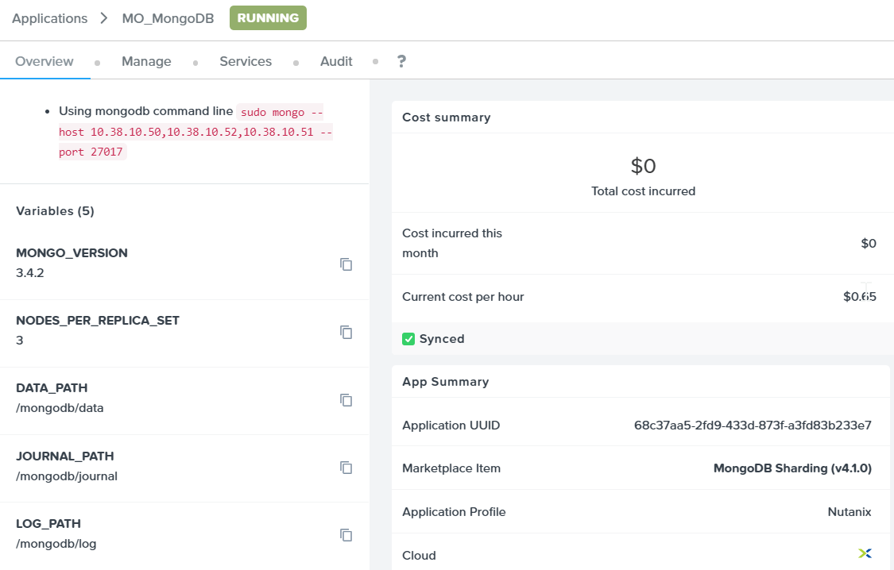

# Overview

In this exercise you will learn how to manage Calm Blueprints within the Nutanix Marketplace. As part of the exercise you will publish a
pre-configured Blueprint to the local Marketplace, clone the Blueprint from the Marketplace for editing, and launch the application.

## Publishing Blueprints from Marketplace Manager

By default, Calm comes pre-seeded with validated Blueprints for multiple open source and enterprise applications. Marketplace Manager acts as a
staging area for publishing default and user-created Blueprints to your local Marketplace. The Marketplace acts as an application store,
providing end users with a catalog of available applications.

1. From **Prism Central > Calm** 
      
2. Select  **Marketplace Manager** from the sidebar.

2. Under **Marketplace Blueprints**, select **Mongo**.

    !!! tip

        The Blueprint description contains key information including licensing, hardware requirements, OS, supported platforms, and limitations.
   

1.  Select the **Calm** project from the right-hand side drop down and
    Click **Publish**.

    

1.  Wait for the Blueprint **Status** to appear as **Published**.

    

1.  Under **Projects Shared With**, select the Project you had created
    earlier and click **Apply**.

    

    :::note
    
    If the **Projects Shared With** drop down menu is unavailable, refresh your browser.

    :::

## Launch Blueprints from Marketplace

1.  From **Prism Central > Calm**, select  **Marketplace** from the
    sidebar. All Blueprints published in Marketplace Manager are visible here.

    

1.  Select the **Mongo** Blueprint and click **Launch**.

    

1.  Fill in the application name and click on **Launch**

    

1.  This picture showed the successful launch of the application

    

## Takeaways

-   By using pre-seeded Blueprints from the Nutanix Marketplace, userscan quickly try out new applications.
-   Marketplace Blueprints can be cloned and modified to suit a user's needs. For example, the pre-seeded LAMP Blueprint could be a
    starting point for a developer looking to swap PHP for a Go application server.
-   Marketplace Blueprints can use local disk images or automatically download associated disk images. Users can create their own keys and
    slipstream them into Blueprints (via cloud-init) to control access.
-   Developers can publish Blueprints to the Marketplace for fast and easy consumption by users.
-   Blueprints can be launched directly from the Marketplace with no additional configuration from users, delivering a public cloud-like
    SaaS experience for end users.
-   Administrators have control over what Blueprints are published to the Marketplace and which projects have access to published Blueprints.
